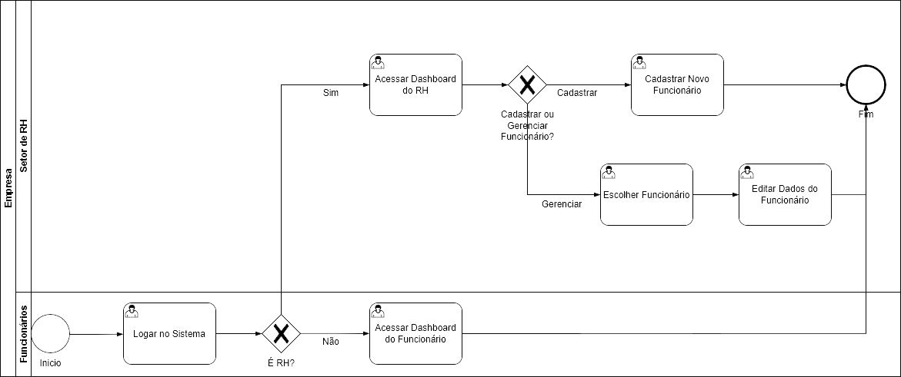
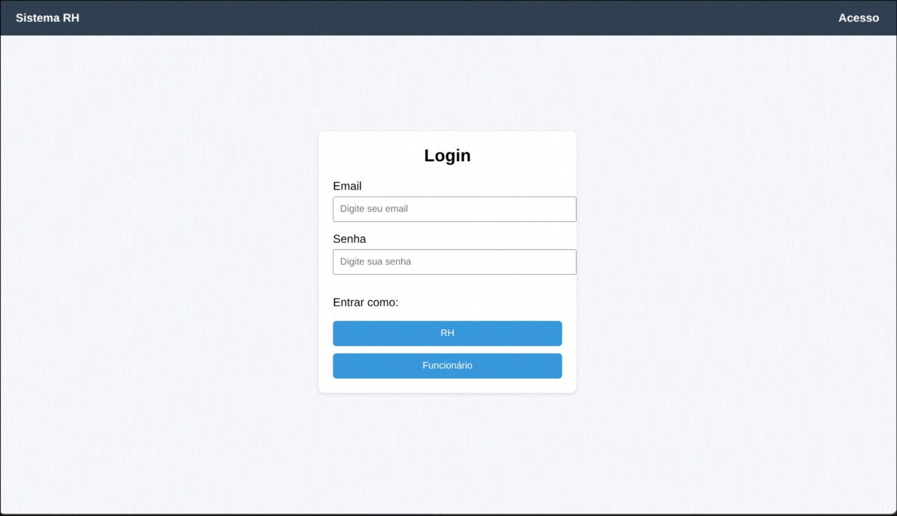
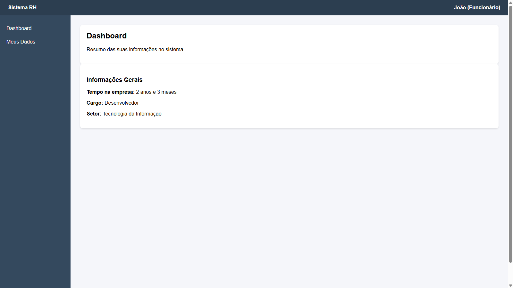
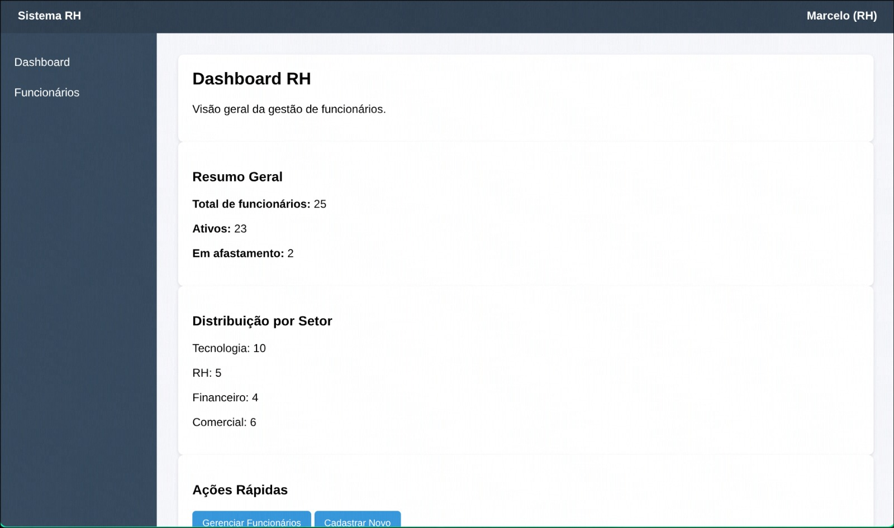
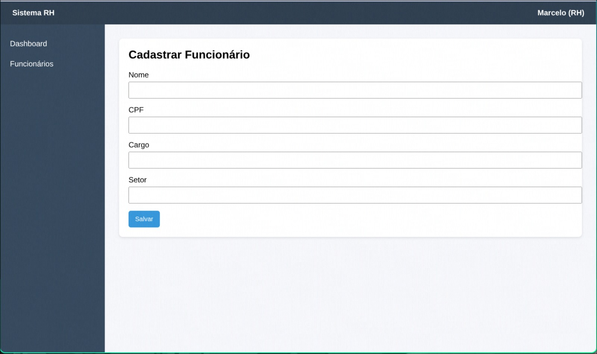
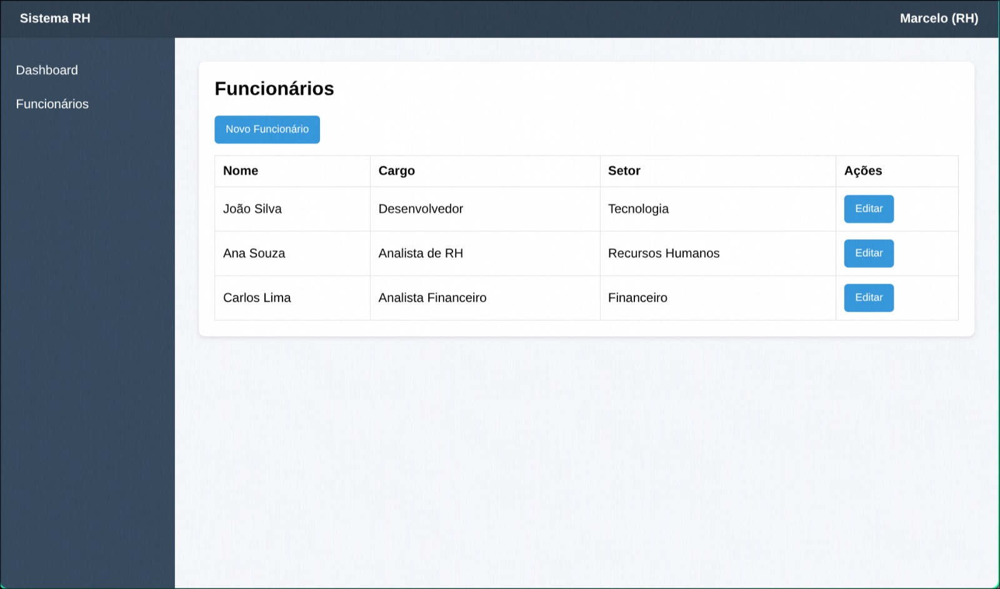
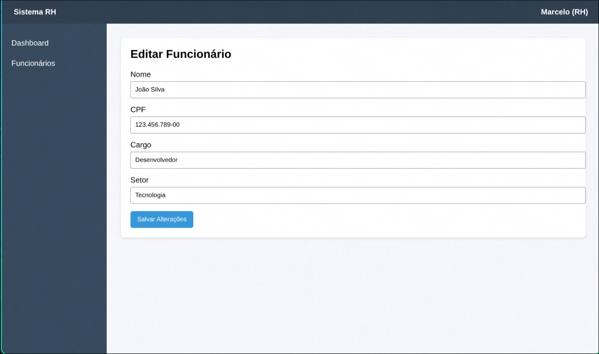

### 3.3.1 Processo 1 – Gestão de Funcionários e Benefícios

O processo ocorre no sistema de gestão da empresa e tem como objetivo permitir o controle e atualização das informações dos funcionários conforme o perfil de acesso do usuário. Ele se inicia quando o usuário realiza login no sistema, informando suas credenciais e selecionando seu perfil.

Após o login, o sistema verifica se o usuário pertence ao setor de RH. Caso não pertença, ele é direcionado ao dashboard do funcionário, onde pode visualizar seus dados e realizar a verificação das suas informações. Após essa consulta, o processo é finalizado.

Caso o usuário seja do RH, ele acessa o dashboard do RH, onde possui acesso a funcionalidades administrativas. Nesse ponto, o sistema apresenta duas opções: cadastrar um novo funcionário ou gerenciar um funcionário existente.

Se a opção escolhida for cadastro, o usuário preenche os dados necessários, como nome, CPF, cargo e setor, e confirma o registro. O processo é encerrado com o novo funcionário cadastrado no sistema.

Se a opção for gerenciamento, o usuário acessa a lista de funcionários, seleciona um registro e realiza a edição dos dados. Após salvar as alterações, o processo é finalizado.

O processo se encerra com a persistência das informações no sistema, resultando no cadastro ou atualização dos dados dos funcionários, que ficam disponíveis para consulta e uso pelo RH e pelo próprio funcionário

#### Detalhamento das atividades

O processo se inicia com o usuário realizando login no sistema. Após o login, ocorre uma decisão para identificar se o usuário pertence ao RH.

Caso não seja RH, o usuário acessa o dashboard do funcionário, onde pode visualizar suas informações. Em seguida, realiza a verificação dos dados e o processo é finalizado.

Caso seja RH, o usuário acessa o dashboard do RH. A partir disso, ocorre uma nova decisão: cadastrar um novo funcionário ou gerenciar um existente.

Se a opção for cadastrar, o usuário realiza o cadastro de um novo funcionário e o processo é encerrado.

Se a opção for gerenciar, o usuário seleciona um funcionário existente, edita seus dados e então o processo é finalizado.

Atividade 1 **Logar no Sistema**

| **Campo** | **Tipo**       | **Restrições**         | **Valor default** |
| --------- | -------------- | ---------------------- | ----------------- |
| Email     | Caixa de texto | Obrigatório; formato de e-mail | — |
| Senha     | Caixa de texto | Obrigatório | — |

| **Comandos**            | **Destino**                      | **Tipo** |
| ----------------------- | -------------------------------- | -------- |
| RH                      | Acessar Dashboard do RH          | default  |
| Funcionário             | Acessar Dashboard do Funcionário | default  |

Atividade 2 **Acessar Dashboard do Funcionário**

| **Campo**        | **Tipo** | **Restrições** | **Valor default** |
| ---------------- | -------- | -------------- | ----------------- |
| Tempo na empresa | Texto    | Somente leitura | calculado         |
| Cargo            | Texto    | Somente leitura | preenchido        |
| Setor            | Texto    | Somente leitura | preenchido        |

| **Comandos** | **Destino** | **Tipo** |
| ------------ | ----------- | -------- |
| —            | Fim         | —        |

Atividade 3 **Acessar Dashboard do RH**

| **Campo**              | **Tipo** | **Restrições** | **Valor default** |
| ---------------------- | -------- | -------------- | ----------------- |
| Total de funcionários  | Número | Somente leitura | calculado |
| Ativos                 | Número | Somente leitura | calculado |
| Em afastamento         | Número | Somente leitura | calculado |
| Distribuição por setor | Lista  | Somente leitura | calculado |

| **Comandos**           | **Destino**                | **Tipo** |
| ---------------------- | -------------------------- | -------- |
| Gerenciar Funcionários | Escolher Funcionário       | default  |
| Cadastrar Novo         | Cadastrar Novo Funcionário | default  |

Atividade 4 **Decisão: Cadastrar ou Gerenciar Funcionário?**

| **Condição** | **Destino**                |
| ------------ | -------------------------- |
| Cadastrar    | Cadastrar Novo Funcionário |
| Gerenciar    | Escolher Funcionário       |

Atividade 5 **Cadastrar Novo Funcionário**

| **Campo** | **Tipo**       | **Restrições** | **Valor default** |
| --------- | -------------- | -------------- | ----------------- |
| Nome      | Caixa de texto | Obrigatório | — |
| CPF       | Caixa de texto | Obrigatório | — |
| Cargo     | Caixa de texto | Obrigatório | — |
| Setor     | Caixa de texto | Obrigatório | — |

| **Comandos** | **Destino** | **Tipo** |
| ------------ | ----------- | -------- |
| Salvar       | Fim         | default  |

Atividade 6 **Escolher Funcionário**

| **Campo**             | **Tipo** | **Restrições** | **Valor default** |
| --------------------- | -------- | -------------- | ----------------- |
| Lista de Funcionários | Tabela | Somente leitura; colunas: Nome, Cargo, Setor, Ações | — |

| **Comandos**       | **Destino**                 | **Tipo** |
| ------------------ | --------------------------- | -------- |
| Novo Funcionário   | Cadastrar Novo Funcionário  | default  |
| Editar             | Editar Dados do Funcionário | default  |

Atividade 7 **Editar Dados do Funcionário**

| **Campo** | **Tipo**       | **Restrições**       | **Valor default** |
| --------- | -------------- | -------------------- | ----------------- |
| Nome      | Caixa de texto | Obrigatório          | preenchido        |
| CPF       | Caixa de texto | Obrigatório; formato válido (CPF) | preenchido |
| Cargo     | Caixa de texto | Obrigatório          | preenchido        |
| Setor     | Caixa de texto | Obrigatório          | preenchido        |

| **Comandos**      | **Destino** | **Tipo** |
| ----------------- | ----------- | -------- |
| Salvar Alterações | Fim         | default  |
