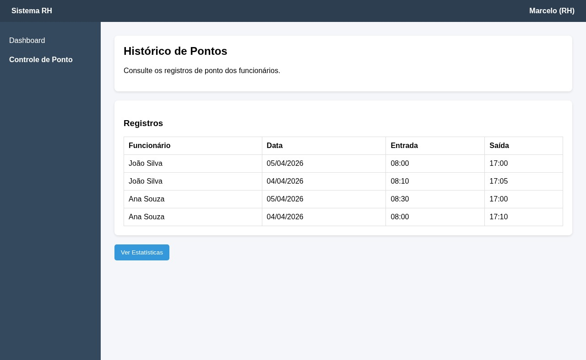
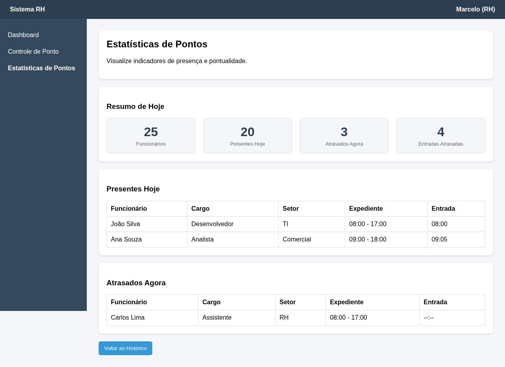
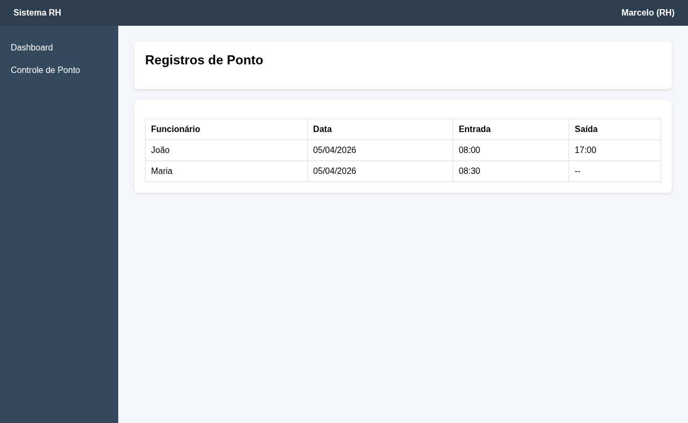
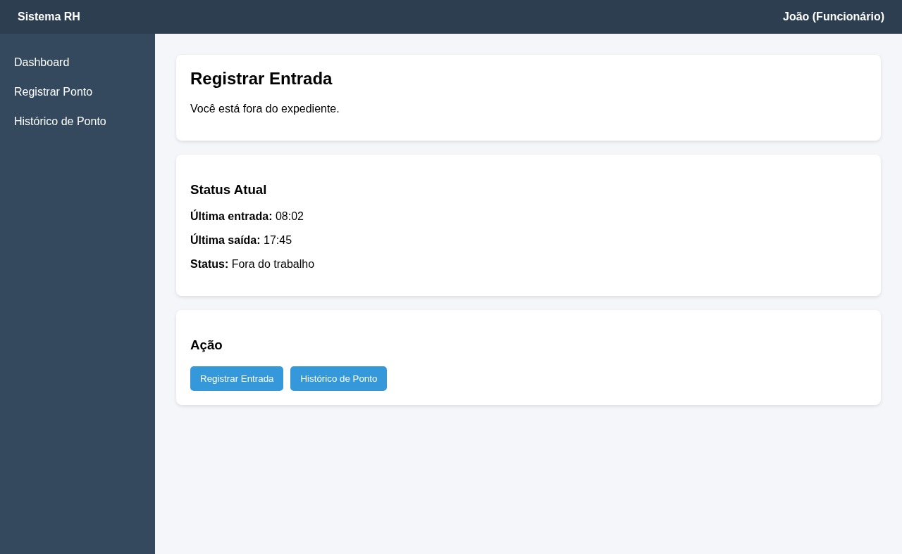

### 3.3.2 Processo 2 – Registro de Ponto dos Funcionários

O processo ocorre no sistema de registro de ponto da empresa e envolve dois perfis: funcionário e gestor de RH. Ele se inicia quando o usuário acessa a página de ponto.

Em seguida, o sistema verifica o tipo de usuário. Caso seja um gestor de RH, ele pode visualizar a tela de histórico de pontos e, a partir dela, acessar a tela de estatísticas de pontos. Após a análise das informações, o processo é encerrado.

Caso o usuário seja um funcionário, ele acessa a tela de registro de ponto. A partir daí, pode escolher entre registrar o ponto ou visualizar o histórico de pontos. Se optar por visualizar o histórico, ele pode consultar os registros e retornar à tela de registro.

Se optar por registrar o ponto, o sistema realiza o registro da ação (entrada ou saída), armazenando os dados. Após isso, o processo é finalizado.

O processo se encerra com o registro do ponto ou com a visualização das informações. O produto final é o ponto registrado ou os dados de histórico e estatísticas exibidos para o usuário.

#### Detalhamento das atividades

**Atividade 1 Visualizar histórico de ponto**

| **Campo** | **Tipo** | **Restrições** | **Valor default** |
| --------- | -------- | -------------- | ----------------- |
| Funcionário | Texto | obrigatório | preenchido |
| Data | Data | obrigatório | preenchido |
| Entrada | Hora | obrigatório | preenchido |
| Saída | Hora | obrigatório | preenchido |

| **Comandos** | **Destino** | **Tipo** |
| ------------ | ----------- | -------- |
| Ver Estatísticas | Estatísticas de Pontos | default |

**Atividade 2 Estatisticas de Pontos**

| **Campo** | **Tipo** | **Restrições** | **Valor default** |
| ---------- | -------- | -------------- | ----------------- |
| Total funcionários | Número | obrigatório | calculado |
| Presentes hoje | Número | obrigatório | calculado |
| Atrasados agora | Número | obrigatório | calculado |
| Entradas atrasadas | Número | obrigatório | calculado |
| Funcionário (Presentes Hoje) | Texto | automático | preenchido |
| Cargo (Presentes Hoje) | Texto | automático | preenchido |
| Setor (Presentes Hoje) | Texto | automático | preenchido |
| Expediente (Presentes Hoje) | Texto | automático | preenchido |
| Entrada (Presentes Hoje) | Hora | automático | preenchido |
| Funcionário (Atrasados Agora) | Texto | automático | preenchido |
| Cargo (Atrasados Agora) | Texto | automático | preenchido |
| Setor (Atrasados Agora) | Texto | automático | preenchido |
| Expediente (Atrasados Agora) | Texto | automático | preenchido |
| Entrada (Atrasados Agora) | Hora | automático | preenchido |

| **Comandos** | **Destino** | **Tipo** |
| ------------ | ----------- | -------- |
| Voltar ao Histórico | Histórico de Pontos | default |

**Atividade 3 Consultar Histórico de Pontos**

| **Campo** | **Tipo** | **Restrições** | **Valor default** |
| ---------- | -------- | -------------- | ----------------- |
| Funcionário | Texto | automático | preenchido |
| Data | Data | automático | preenchido |
| Entrada | Hora | automático | preenchido |
| Saída | Hora | automático | preenchido |

| **Comandos** | **Destino** | **Tipo** |
| ------------ | ----------- | -------- |
| Ver Estatísticas | Estatísticas de Pontos | default |

**Registros de Pontos**

| **Campo** | **Tipo** | **Restrições** | **Valor default** |
| ---------- | -------- | -------------- | ----------------- |
| Funcionário | Texto | obrigatório | preenchido |
| Data | Data | obrigatório | preenchido |
| Entrada | Hora | obrigatório | preenchido |
| Saída | Hora | pode estar vazio | preenchido |

| **Comandos** | **Destino** | **Tipo** |
| ------------ | ----------- | -------- |
| — | — | — |

**Atividade 4 Registrar entrada**

| **Campo** | **Tipo** | **Restrições** | **Valor default** |
| ---------- | -------- | -------------- | ----------------- |
| Última entrada | Hora | automático | preenchido |
| Última saída | Hora | automático | preenchido |
| Status atual | Caixa de texto | obrigatório | calculado |

| **Comandos** | **Destino** | **Tipo** |
| ------------ | ----------- | -------- |
| Registrar entrada | Receber dados do registro | default |
| Histórico de ponto | Visualizar histórico do funcionário | default |

**Atividade 5 Registrar saída**

| **Campo** | **Tipo** | **Restrições** | **Valor default** |
| ---------- | -------- | -------------- | ----------------- |
| Última entrada | Hora | automático | preenchido |
| Última saída | Hora | automático | pode estar vazio |
| Status atual | Caixa de texto | obrigatório | calculado |

| **Comandos** | **Destino** | **Tipo** |
| ------------ | ----------- | -------- |
| Registrar saída | Receber dados do registro | default |
| Histórico de ponto | Visualizar histórico do funcionário | default |
