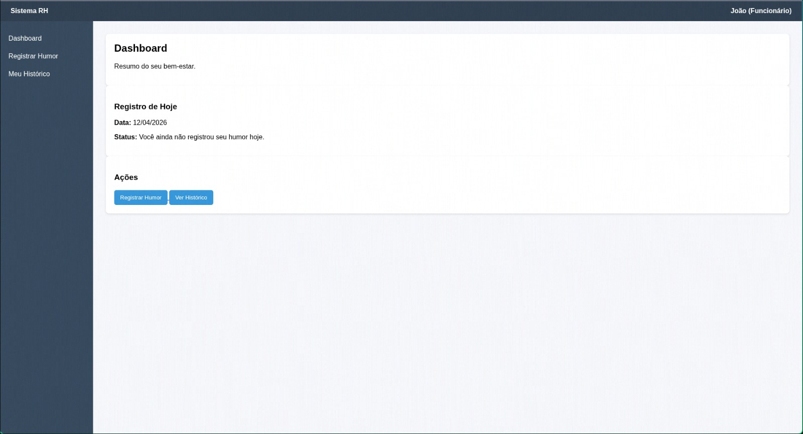
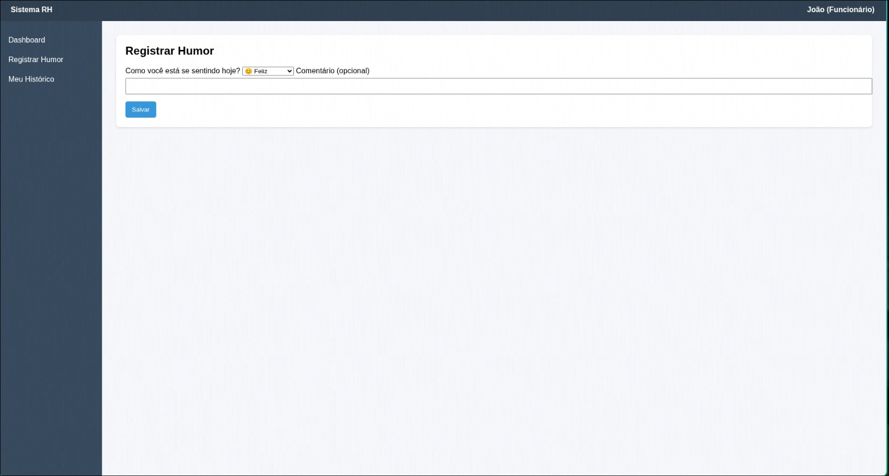
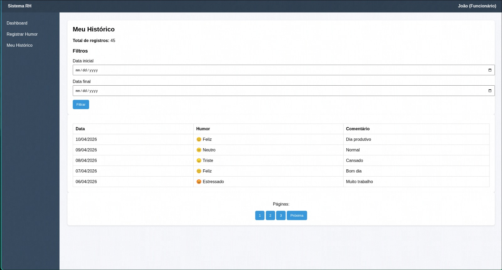
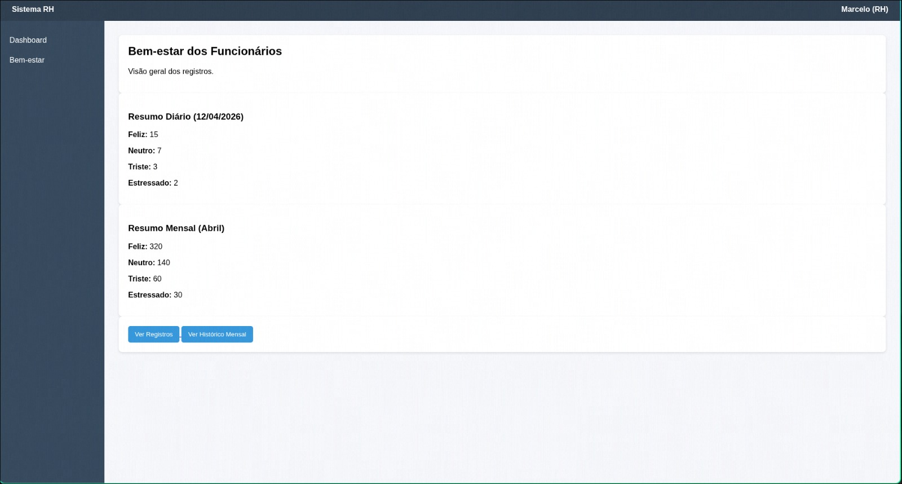
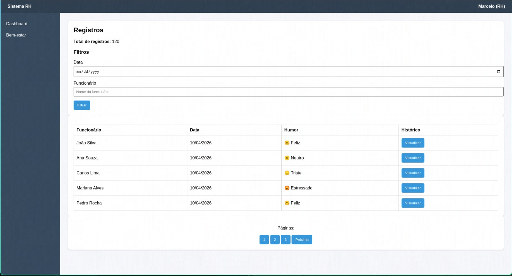
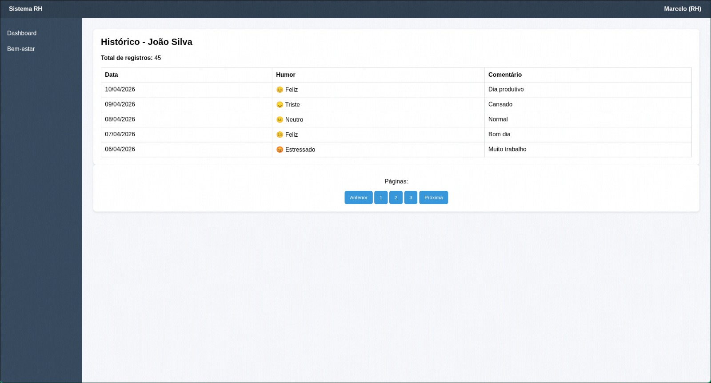
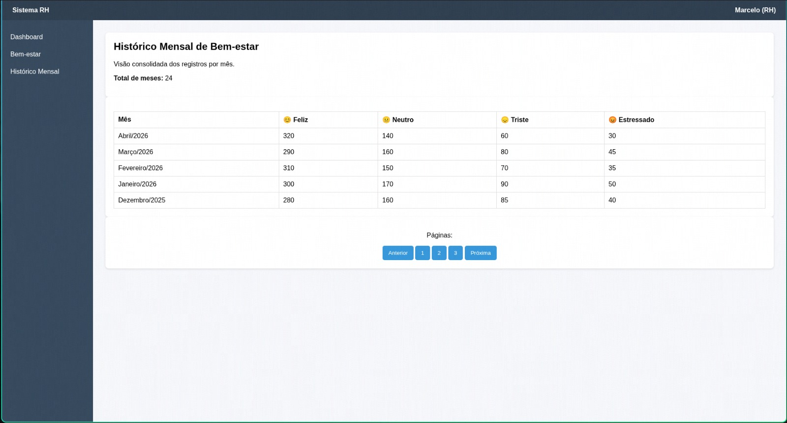

### 3.3.3 Processo 3 – Controle de Humor

Registro e acompanhamento de bem-estar dos funcionários

O processo ocorre no sistema da empresa e tem como objetivo registrar e acompanhar o bem-estar dos funcionários por meio do controle de humor. Ele se inicia quando o usuário acessa a página de humor.

Em seguida, o sistema verifica o tipo de usuário. Caso seja um gestor de RH, ele acessa o painel de registros de humor, onde pode escolher entre visualizar o histórico geral, o histórico de um usuário específico ou o histórico mensal. Após a visualização das informações, o processo é encerrado.

Caso o usuário seja um funcionário, ele acessa a página de humor, onde pode escolher entre visualizar o histórico de seus registros ou registrar um novo humor. Se optar por visualizar o histórico, ele consulta os dados e o processo pode ser encerrado. Se optar por registrar o humor, ele informa seu estado (como feliz, neutro, triste ou estressado) e, opcionalmente, adiciona um comentário. Após salvar, o registro é armazenado e o processo é finalizado.

O processo se encerra com o registro do humor ou com a visualização das informações. O produto final é o histórico de humor atualizado, permitindo o acompanhamento do bem-estar dos funcionários pelo próprio usuário e pelo RH

#### Detalhamento das atividades

Atividade 1 **Visualizar página de humor**

| Campo  | Tipo           | Restrições      | Valor default |
| ------ | -------------- | --------------- | ------------- |
| Data   | Data           | Somente leitura | preenchido    |
| Status | Caixa de texto | Somente leitura | calculado     |

| Comando         | Destino                                    | Tipo    |
| --------------- | ------------------------------------------ | ------- |
| Registrar Humor | Registrar Humor                            | default |
| Ver Histórico   | Visualizar histórico de registros de humor | default |

---

Atividade 2 **Registrar Humor**

| Campo                            | Tipo          | Restrições                                             | Valor default |
| -------------------------------- | ------------- | ------------------------------------------------------ | ------------- |
| Como você está se sentindo hoje? | Seleção única | Obrigatório; opções: Feliz, Neutro, Triste, Estressado | Feliz         |
| Comentário                       | Área de texto | Opcional                                               | vazio         |

| Comando | Destino         | Tipo    |
| ------- | --------------- | ------- |
| Salvar  | Registrar humor | default |

---

Atividade 3 **Visualizar histórico de registros de humor**

| Campo               | Tipo   | Restrições      | Valor default |
| ------------------- | ------ | --------------- | ------------- |
| Total de registros  | Número | Somente leitura | calculado     |
| Data inicial        | Data   | Opcional        | vazio         |
| Data final          | Data   | Opcional        | vazio         |
| Data (tabela)       | Data   | Somente leitura | preenchido    |
| Humor (tabela)      | Texto  | Somente leitura | preenchido    |
| Comentário (tabela) | Texto  | Somente leitura | preenchido    |

| Comando          | Destino                                    | Tipo      |
| ---------------- | ------------------------------------------ | --------- |
| Filtrar          | Visualizar histórico de registros de humor | default   |
| Página anterior  | Página anterior do histórico               | paginação |
| Próxima página   | Próxima página do histórico                | paginação |
| Número da página | Página selecionada                         | paginação |

---

Atividade 4 **Visualizar painel de registros de humor**

| Campo                      | Tipo   | Restrições      | Valor default |
| -------------------------- | ------ | --------------- | ------------- |
| Feliz (Resumo Diário)      | Número | Somente leitura | calculado     |
| Neutro (Resumo Diário)     | Número | Somente leitura | calculado     |
| Triste (Resumo Diário)     | Número | Somente leitura | calculado     |
| Estressado (Resumo Diário) | Número | Somente leitura | calculado     |
| Feliz (Resumo Mensal)      | Número | Somente leitura | calculado     |
| Neutro (Resumo Mensal)     | Número | Somente leitura | calculado     |
| Triste (Resumo Mensal)     | Número | Somente leitura | calculado     |
| Estressado (Resumo Mensal) | Número | Somente leitura | calculado     |

| Comando              | Destino                                           | Tipo    |
| -------------------- | ------------------------------------------------- | ------- |
| Ver Registros        | Visualizar histórico geral de registros de humor  | default |
| Ver Histórico Mensal | Visualizar histórico mensal de registros de humor | default |

---

Atividade 5 **Visualizar histórico geral de registros de humor**

| Campo                | Tipo           | Restrições      | Valor default |
| -------------------- | -------------- | --------------- | ------------- |
| Total de registros   | Número         | Somente leitura | calculado     |
| Data                 | Data           | Opcional        | vazio         |
| Funcionário          | Caixa de texto | Opcional        | vazio         |
| Funcionário (tabela) | Texto          | Somente leitura | preenchido    |
| Data (tabela)        | Data           | Somente leitura | preenchido    |
| Humor (tabela)       | Texto          | Somente leitura | preenchido    |
| Histórico            | Botão          | Somente leitura | Visualizar    |

| Comando          | Destino                                             | Tipo      |
| ---------------- | --------------------------------------------------- | --------- |
| Filtrar          | Visualizar histórico geral de registros de humor    | default   |
| Visualizar       | Visualizar histórico de humor de usuário específico | default   |
| Página anterior  | Página anterior                                     | paginação |
| Próxima página   | Próxima página                                      | paginação |
| Número da página | Página selecionada                                  | paginação |

---

Atividade 6 **Visualizar histórico de humor de usuário específico**

| Campo              | Tipo   | Restrições      | Valor default |
| ------------------ | ------ | --------------- | ------------- |
| Total de registros | Número | Somente leitura | calculado     |
| Data               | Data   | Somente leitura | preenchido    |
| Humor              | Texto  | Somente leitura | preenchido    |
| Comentário         | Texto  | Somente leitura | preenchido    |

| Comando          | Destino            | Tipo      |
| ---------------- | ------------------ | --------- |
| Página anterior  | Página anterior    | paginação |
| Próxima página   | Próxima página     | paginação |
| Número da página | Página selecionada | paginação |

---

Atividade 7 **Visualizar histórico mensal de registros de humor**

| Campo          | Tipo   | Restrições      | Valor default |
| -------------- | ------ | --------------- | ------------- |
| Total de meses | Número | Somente leitura | calculado     |
| Mês            | Texto  | Somente leitura | preenchido    |
| Feliz          | Número | Somente leitura | calculado     |
| Neutro         | Número | Somente leitura | calculado     |
| Triste         | Número | Somente leitura | calculado     |
| Estressado     | Número | Somente leitura | calculado     |

| Comando          | Destino            | Tipo      |
| ---------------- | ------------------ | --------- |
| Página anterior  | Página anterior    | paginação |
| Próxima página   | Próxima página     | paginação |
| Número da página | Página selecionada | paginação |

