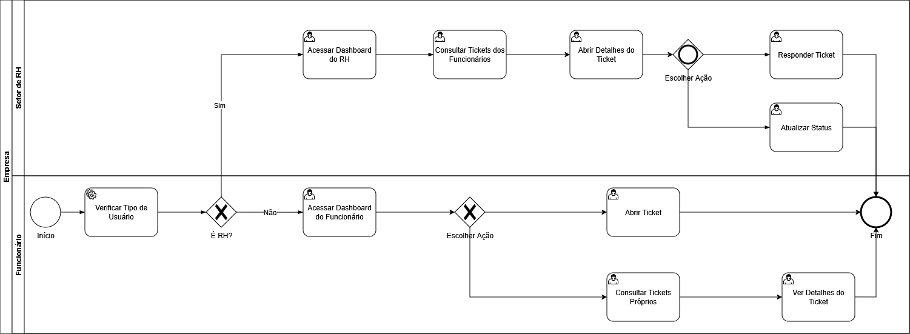
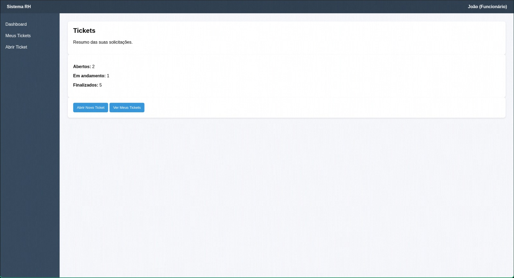
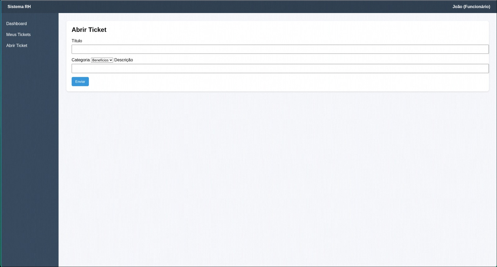
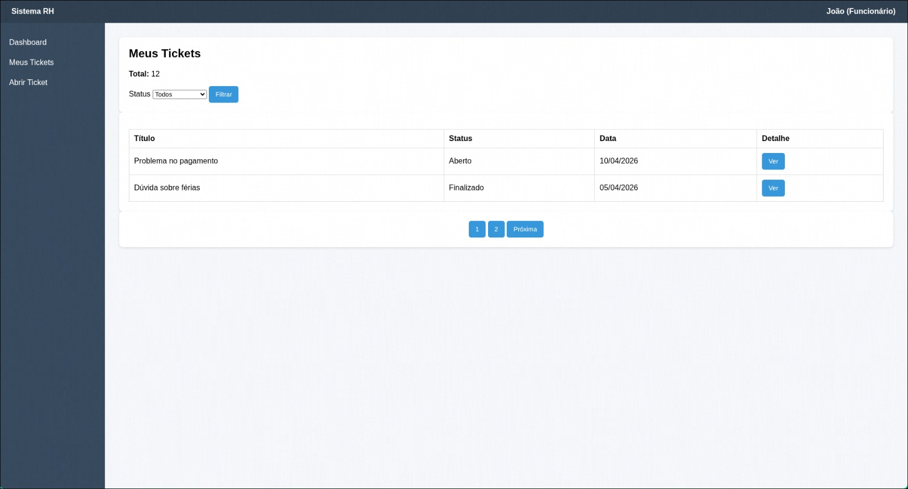
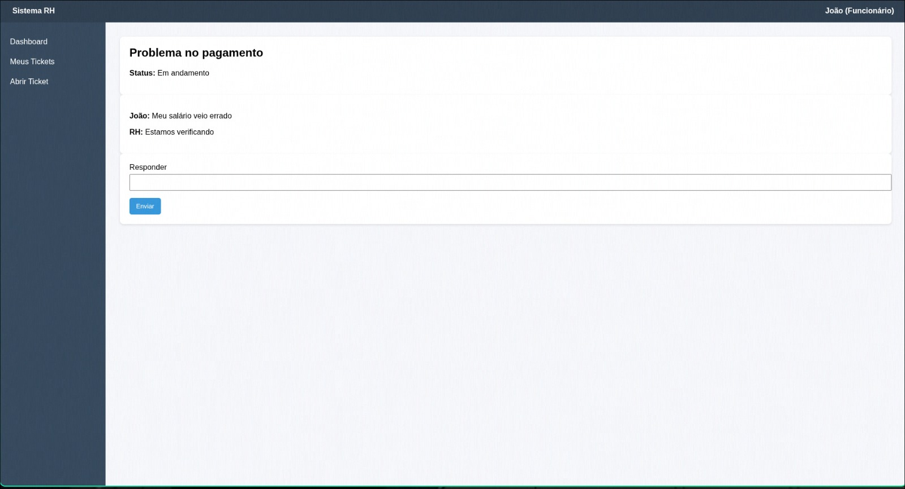
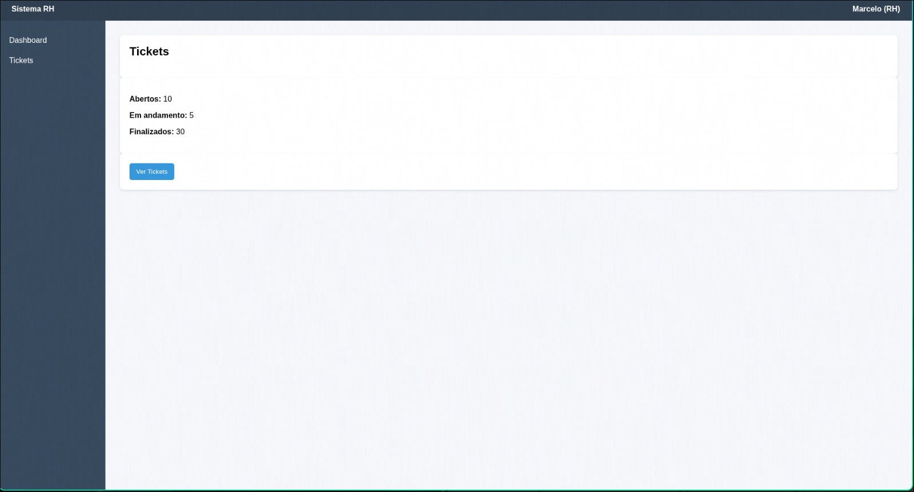
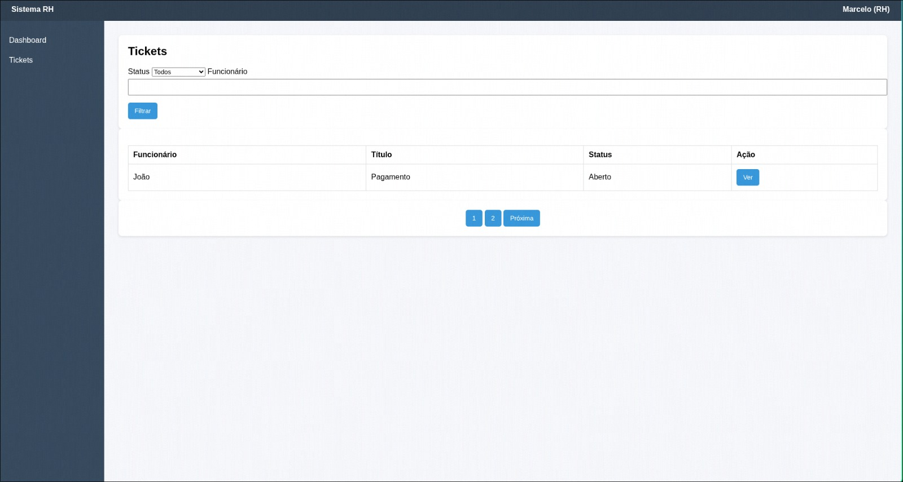
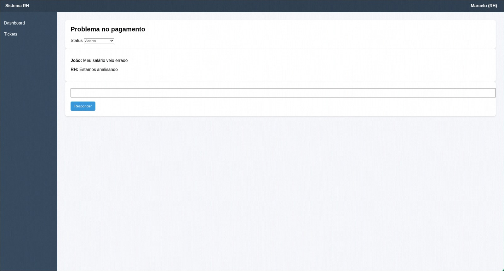

### 3.3.4 Processo 4 – Gestão de Tickets

Comunicação entre funcionários e RH por meio de tickets

O processo ocorre no sistema da empresa e tem como objetivo permitir a comunicação entre funcionários e o setor de RH por meio de tickets. Ele se inicia quando o usuário acessa o sistema e tem seu tipo de perfil verificado.

Caso o usuário seja do RH, ele acessa o dashboard do RH e pode consultar os tickets dos funcionários. Ao selecionar um ticket, ele visualiza seus detalhes e pode escolher entre responder ou atualizar o status. Após realizar a ação, o processo é finalizado.

Caso o usuário seja um funcionário, ele acessa o dashboard do funcionário e pode escolher entre abrir um novo ticket ou consultar seus tickets existentes. Se optar por abrir um ticket, ele preenche as informações necessárias e envia a solicitação, encerrando o processo. Se optar por consultar tickets, ele visualiza a lista, pode acessar os detalhes de um ticket e acompanhar sua situação, finalizando o processo após a consulta.

O processo se encerra com o registro de um novo ticket, a atualização de um ticket existente ou a visualização das informações. O produto final é o ticket registrado ou atualizado, permitindo o acompanhamento e a resolução das solicitações entre funcionário e RH.

#### Detalhamento das atividades

Atividade 1 **Acessar Dashboard do Funcionário**

| **Campo**    | **Tipo** | **Restrições**  | **Valor default** |
| ------------ | -------- | --------------- | ----------------- |
| Abertos      | Número   | Somente leitura | —                 |
| Em andamento | Número   | Somente leitura | —                 |
| Finalizados  | Número   | Somente leitura | —                 |

| **Comandos**      | **Destino**                | **Tipo** |
| ----------------- | -------------------------- | -------- |
| Abrir Novo Ticket | Abrir Ticket               | default  |
| Ver Meus Tickets  | Consultar Tickets Próprios | default  |

---

Atividade 2 **Abrir Ticket**

| **Campo** | **Tipo**       | **Restrições** | **Valor default** |
| --------- | -------------- | -------------- | ----------------- |
| Título    | Caixa de texto | Obrigatório    | —                 |
| Categoria | Seleção única  | Obrigatório    | Benefícios        |
| Descrição | Área de texto  | Obrigatório    | —                 |

| **Comandos** | **Destino**       | **Tipo** |
| ------------ | ----------------- | -------- |
| Enviar       | Fim do Processo 4 | default  |

---

Atividade 3 **Consultar Tickets Próprios**

| **Campo** | **Tipo**      | **Restrições**                                            | **Valor default** |
| --------- | ------------- | --------------------------------------------------------- | ----------------- |
| Status    | Seleção única | Opcional; opções: Todos, Aberto, Em andamento, Finalizado | Todos             |
| Tickets   | Tabela        | Somente leitura; colunas: Título, Status, Data, Detalhe   | —                 |

| **Comandos** | **Destino**                | **Tipo** |
| ------------ | -------------------------- | -------- |
| Filtrar      | Consultar Tickets Próprios | default  |
| Ver          | Ver Detalhes do Ticket     | default  |

---

Atividade 4 **Ver Detalhes do Ticket**

| **Campo** | **Tipo**      | **Restrições** | **Valor default** |
| --------- | ------------- | -------------- | ----------------- |
| Responder | Área de texto | Opcional       | —                 |

| **Comandos** | **Destino**            | **Tipo** |
| ------------ | ---------------------- | -------- |
| Enviar       | Ver Detalhes do Ticket | default  |

---

Atividade 5 **Acessar Dashboard do RH**

| **Campo**    | **Tipo** | **Restrições**  | **Valor default** |
| ------------ | -------- | --------------- | ----------------- |
| Abertos      | Número   | Somente leitura | —                 |
| Em andamento | Número   | Somente leitura | —                 |
| Finalizados  | Número   | Somente leitura | —                 |

| **Comandos** | **Destino**                        | **Tipo** |
| ------------ | ---------------------------------- | -------- |
| Ver Tickets  | Consultar Tickets dos Funcionários | default  |

---

Atividade 6 **Consultar Tickets dos Funcionários**

| **Campo**   | **Tipo**       | **Restrições**                                              | **Valor default** |
| ----------- | -------------- | ----------------------------------------------------------- | ----------------- |
| Status      | Seleção única  | Opcional; opções: Todos, Aberto, Em andamento, Finalizado   | Todos             |
| Funcionário | Caixa de texto | Opcional                                                    | —                 |
| Tickets     | Tabela         | Somente leitura; colunas: Funcionário, Título, Status, Ação | —                 |

| **Comandos** | **Destino**                        | **Tipo** |
| ------------ | ---------------------------------- | -------- |
| Filtrar      | Consultar Tickets dos Funcionários | default  |
| Ver          | Abrir Detalhes do Ticket           | default  |

---

Atividade 7 **Abrir Detalhes do Ticket**
| **Campo** | **Tipo** | **Restrições** | **Valor default** |
| --- | --- | --- | --- |
| Status | Seleção única | Obrigatório; opções: Aberto, Em andamento, Finalizado | Aberto |

| **Comandos**     | **Destino**              | **Tipo** |
| ---------------- | ------------------------ | -------- |
| Salvar           | Abrir Detalhes do Ticket | default  |
| Responder Ticket | Responder Ticket         | default  |

---

Atividade 8 **Responder Ticket**

| **Campo** | **Tipo**      | **Restrições** | **Valor default** |
| --------- | ------------- | -------------- | ----------------- |
| Resposta  | Área de texto | Obrigatório    | —                 |

| **Comandos** | **Destino**       | **Tipo** |
| ------------ | ----------------- | -------- |
| Responder    | Fim do Processo 4 | default  |
