### 3.3.5 Processo 5 – Gestão de Benefícios
Gerenciamento de benefícios adquiridos pelos funcionários através de pontos

Processo responsável pelos benefícios que o funcionário pode adquirir dentro da empresa, utilizando um sistema de pontos. O funcionário pode abrir a loja de benefícios, ver detalhes do benefício e, se tiver saldo o suficiente, adquirí-lo. Ele também pode ver seus benefícios já resgatados. O gestor de RH pode cadastrar, editar e remover benefícios para serem resgatados pelos funcionários. Ele também pode adicionar ou remover pontos extras, em casos especiais. Além disso, o gestor também pode ver as solicitações de resgate postadas por funcionários e decidir se as aprova ou as recusa. Finalmente, o gestor pode ver o histórico de benefícios de cada funcionário individualmente.

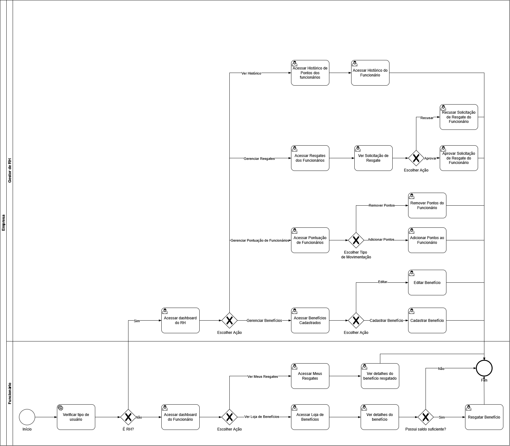

#### Detalhamento das atividades

Atividade 1 **Acessar Dashboard do Funcionário**
| **Campo** | **Tipo** | **Restrições** | **Valor default** |
| --- | --- | --- | --- |
| Saldo atual | Número | Somente leitura | — |
| Benefícios disponíveis | Número | Somente leitura | — |
| Resgates realizados | Número | Somente leitura | — |
| Últimos Resgates | Tabela | Somente leitura; colunas: Benefício, Pontos, Status, Data | — |
 
| **Comandos** | **Destino** | **Tipo** |
| --- | --- | --- |
| Ver Loja de Benefícios | Acessar Loja de Benefícios | default |
| Ver Meus Resgates | Acessar Meus Resgates | default |
 
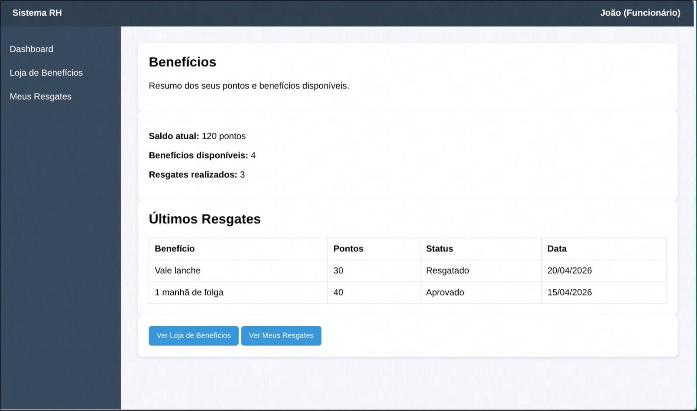
 
---
 
Atividade 2 **Acessar Loja de Benefícios**
| **Campo** | **Tipo** | **Restrições** | **Valor default** |
| --- | --- | --- | --- |
| Saldo atual | Número | Somente leitura | — |
| Buscar benefício | Caixa de texto | Opcional | — |
| Benefícios | Tabela | Somente leitura; colunas: Benefício, Custo, Descrição, Ação | — |
 
| **Comandos** | **Destino** | **Tipo** |
| --- | --- | --- |
| Buscar | Acessar Loja de Benefícios | default |
| Ver | Ver Detalhes do Benefício | default |
| Próxima | Acessar Loja de Benefícios | default |
 
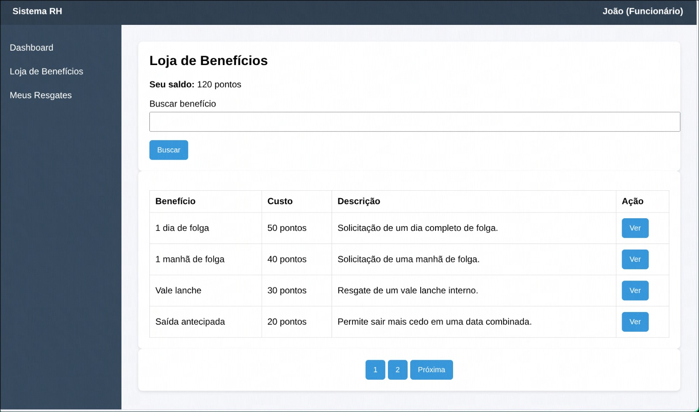
 
---
 
Atividade 3 **Ver Detalhes do Benefício**
| **Campo** | **Tipo** | **Restrições** | **Valor default** |
| --- | --- | --- | --- |
| Nome | Texto | Somente leitura | — |
| Custo | Número | Somente leitura | — |
| Seu saldo | Número | Somente leitura | — |
| Precisa aprovação do RH | Texto | Somente leitura | — |
| Descrição | Texto | Somente leitura | — |
 
| **Comandos** | **Destino** | **Tipo** |
| --- | --- | --- |
| Confirmar Resgate | Resgatar Benefício | default |
| Voltar | Acessar Loja de Benefícios | default |
 
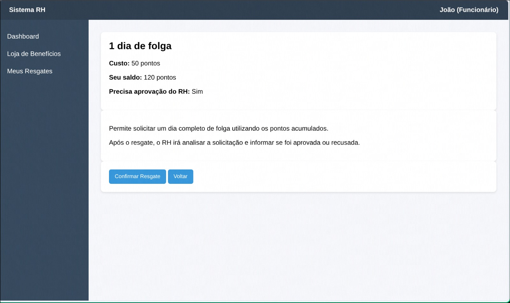
 
---
 
Atividade 4 **Acessar Meus Resgates**
| **Campo** | **Tipo** | **Restrições** | **Valor default** |
| --- | --- | --- | --- |
| Total | Número | Somente leitura | — |
| Status | Seleção única | Opcional; opções: Todos, Pendente, Aprovado, Resgatado | Todos |
| Resgates | Tabela | Somente leitura; colunas: Benefício, Pontos usados, Status, Data, Detalhe | — |
 
| **Comandos** | **Destino** | **Tipo** |
| --- | --- | --- |
| Filtrar | Acessar Meus Resgates | default |
| Ver | Ver Detalhes do Resgate | default |
 
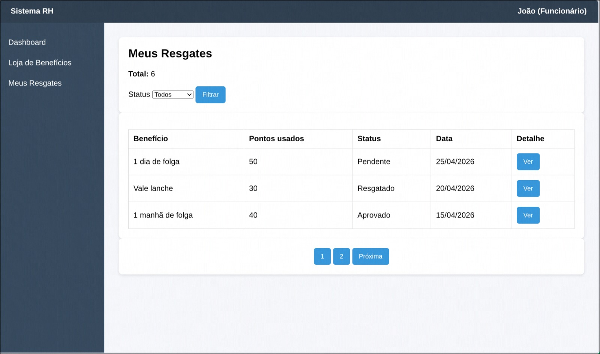
 
---
 
Atividade 5 **Ver Detalhes do Resgate**
| **Campo** | **Tipo** | **Restrições** | **Valor default** |
| --- | --- | --- | --- |
| Nome do benefício | Texto | Somente leitura | — |
| Pontos utilizados | Número | Somente leitura | — |
| Data do resgate | Data | Somente leitura | — |
| Status | Texto | Somente leitura | — |
| Observação do RH | Texto | Somente leitura | — |
 
| **Comandos** | **Destino** | **Tipo** |
| --- | --- | --- |
| Voltar | Acessar Meus Resgates | default |
 
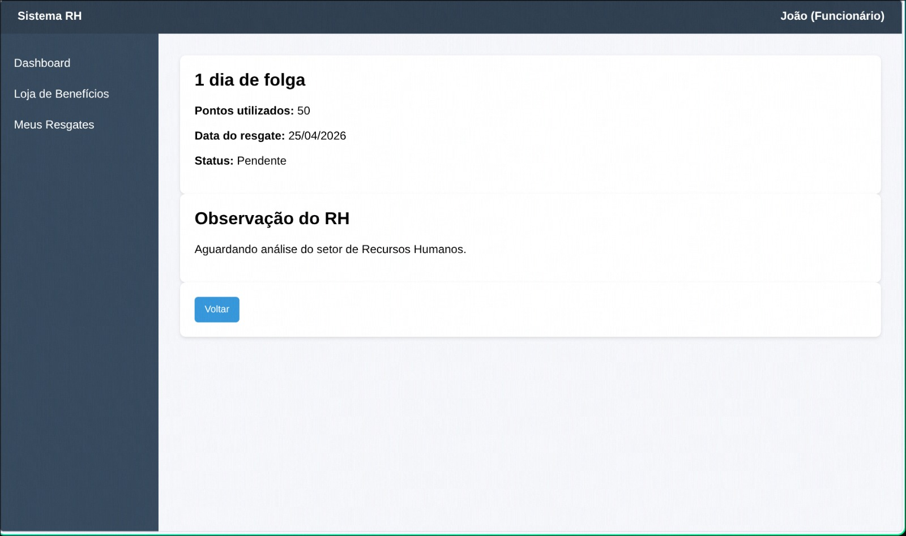
 
---
 
Atividade 6 **Acessar Dashboard do RH**
| **Campo** | **Tipo** | **Restrições** | **Valor default** |
| --- | --- | --- | --- |
| Benefícios cadastrados | Número | Somente leitura | — |
| Pontos distribuídos | Número | Somente leitura | — |
| Resgates realizados | Número | Somente leitura | — |
| Resgates pendentes | Número | Somente leitura | — |
 
| **Comandos** | **Destino** | **Tipo** |
| --- | --- | --- |
| Gerenciar Benefícios | Acessar Benefícios Cadastrados | default |
| Gerenciar Pontuação de Funcionários | Acessar Pontuação de Funcionários | default |
| Gerenciar Resgates | Acessar Resgates dos Funcionários | default |
| Ver Histórico | Acessar Histórico de Pontos dos Funcionários | default |
 
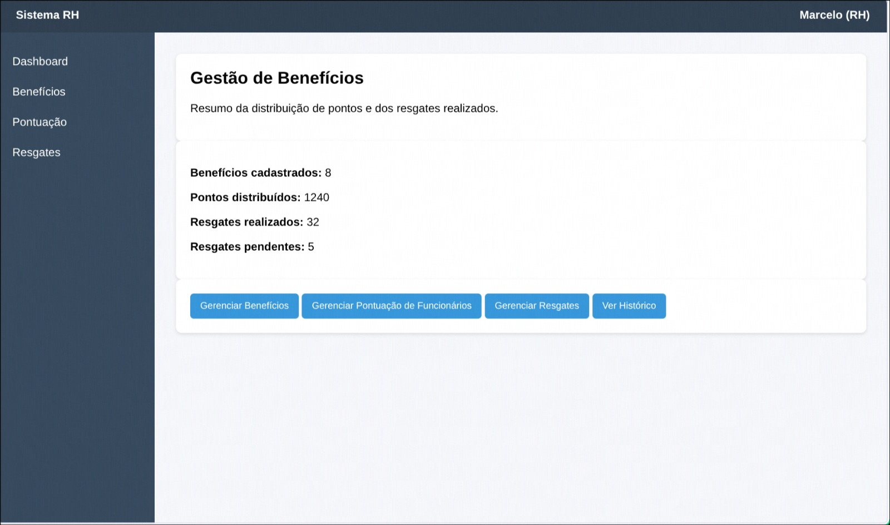
 
---
 
Atividade 7 **Acessar Benefícios Cadastrados**
| **Campo** | **Tipo** | **Restrições** | **Valor default** |
| --- | --- | --- | --- |
| Nome do benefício | Caixa de texto | Opcional | — |
| Status | Seleção única | Opcional; opções: Todos, Ativo, Inativo | Todos |
| Benefícios | Tabela | Somente leitura; colunas: Benefício, Custo, Status, Precisa aprovação, Ação | — |
 
| **Comandos** | **Destino** | **Tipo** |
| --- | --- | --- |
| Filtrar | Acessar Benefícios Cadastrados | default |
| Cadastrar Benefício | Cadastrar Benefício | default |
| Ver | Acessar Benefícios Cadastrados | default |
| Editar | Editar Benefício | default |
| Desativar | Acessar Benefícios Cadastrados | default |
| Próxima | Acessar Benefícios Cadastrados | default |
 
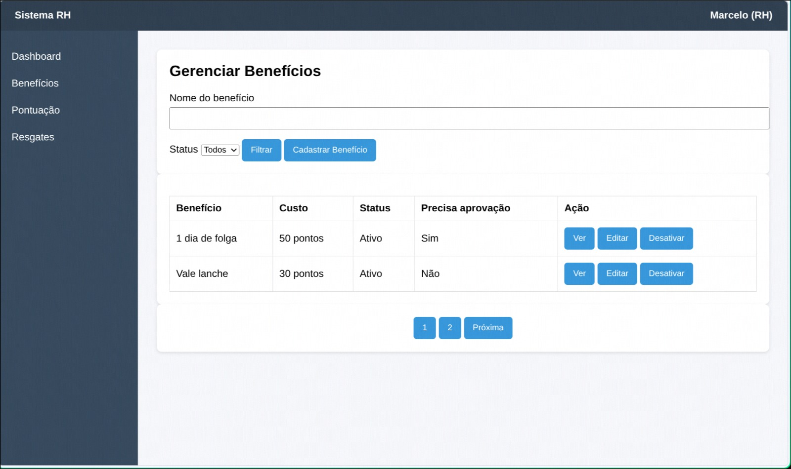
 
---
 
Atividade 8 **Cadastrar Benefício**
| **Campo** | **Tipo** | **Restrições** | **Valor default** |
| --- | --- | --- | --- |
| Nome do benefício | Caixa de texto | Obrigatório | — |
| Custo em pontos | Número | Obrigatório | — |
| Descrição | Área de texto | Obrigatório | — |
| Status | Seleção única | Obrigatório; opções: Ativo, Inativo | Ativo |
| Precisa aprovação? | Seleção única | Obrigatório; opções: Sim, Não | Sim |
 
| **Comandos** | **Destino** | **Tipo** |
| --- | --- | --- |
| Cadastrar | Fim do Processo 5 | default |
| Cancelar | Acessar Benefícios Cadastrados | default |
 

 
---
 
Atividade 9 **Editar Benefício**
| **Campo** | **Tipo** | **Restrições** | **Valor default** |
| --- | --- | --- | --- |
| Nome do benefício | Caixa de texto | Obrigatório | — |
| Custo em pontos | Número | Obrigatório | — |
| Descrição | Área de texto | Obrigatório | — |
| Status | Seleção única | Obrigatório; opções: Ativo, Inativo | Ativo |
| Precisa aprovação? | Seleção única | Obrigatório; opções: Sim, Não | Sim |
 
| **Comandos** | **Destino** | **Tipo** |
| --- | --- | --- |
| Salvar Alterações | Acessar Benefícios Cadastrados | default |
| Cancelar | Acessar Benefícios Cadastrados | default |
 
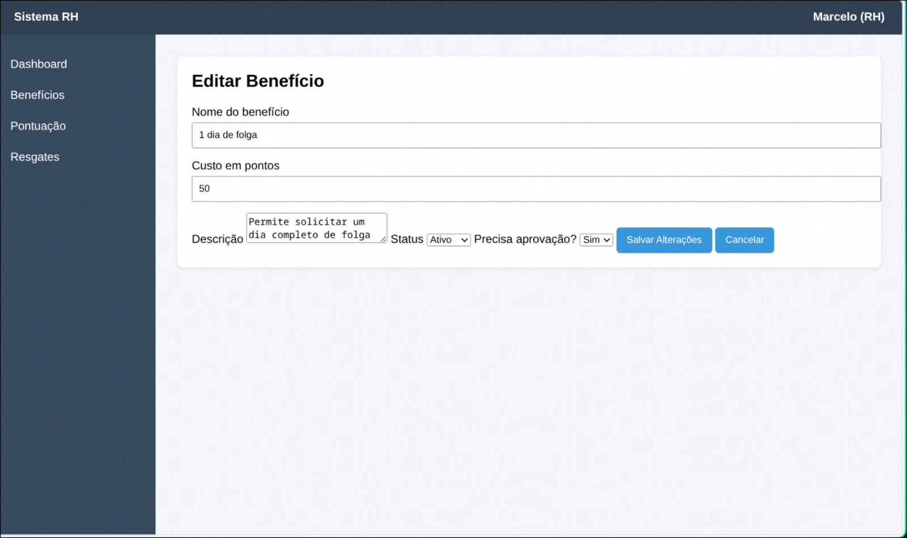
 
---
 
Atividade 10 **Acessar Pontuação de Funcionários**
| **Campo** | **Tipo** | **Restrições** | **Valor default** |
| --- | --- | --- | --- |
| Funcionário | Caixa de texto | Obrigatório | — |
| Tipo de movimentação | Seleção única | Obrigatório; opções: Adicionar pontos, Remover pontos | Adicionar pontos |
| Quantidade de pontos | Número | Obrigatório | — |
| Motivo | Seleção única | Obrigatório; opções: Bom desempenho, … | Bom desempenho |
| Observação | Área de texto | Opcional | — |
 
| **Comandos** | **Destino** | **Tipo** |
| --- | --- | --- |
| Salvar Movimentação | Fim do Processo 5 | default |
 
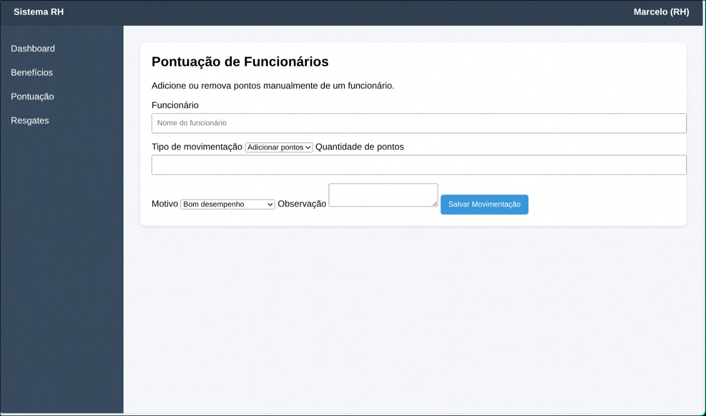
 
---
 
Atividade 11 **Acessar Resgates dos Funcionários**
| **Campo** | **Tipo** | **Restrições** | **Valor default** |
| --- | --- | --- | --- |
| Status | Seleção única | Opcional; opções: Todos, Pendente, Aprovado, Resgatado | Todos |
| Funcionário | Caixa de texto | Opcional | — |
| Resgates | Tabela | Somente leitura; colunas: Funcionário, Benefício, Pontos usados, Status, Data, Ação | — |
 
| **Comandos** | **Destino** | **Tipo** |
| --- | --- | --- |
| Filtrar | Acessar Resgates dos Funcionários | default |
| Ver | Ver Solicitação de Resgate | default |
| Próxima | Acessar Resgates dos Funcionários | default |
 
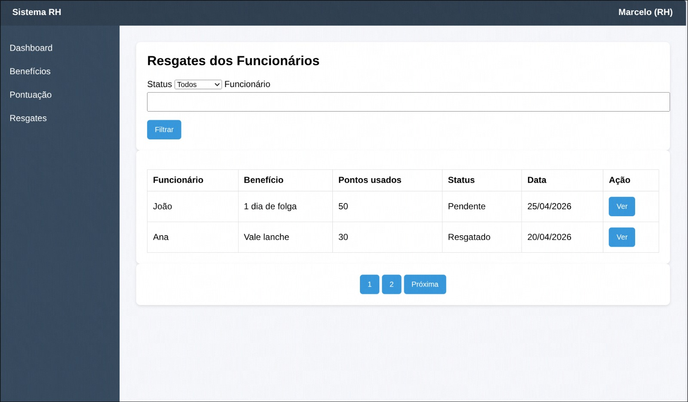
 
---
 
Atividade 12 **Ver Solicitação de Resgate**
| **Campo** | **Tipo** | **Restrições** | **Valor default** |
| --- | --- | --- | --- |
| Funcionário | Texto | Somente leitura | — |
| Benefício | Texto | Somente leitura | — |
| Pontos utilizados | Número | Somente leitura | — |
| Data da solicitação | Data | Somente leitura | — |
| Status | Texto | Somente leitura | — |
| Observação do RH | Área de texto | Opcional | — |
 
| **Comandos** | **Destino** | **Tipo** |
| --- | --- | --- |
| Aprovar | Aprovar Solicitação de Resgate do Funcionário | default |
| Recusar | Recusar Solicitação de Resgate do Funcionário | default |
| Voltar | Acessar Resgates dos Funcionários | default |
 
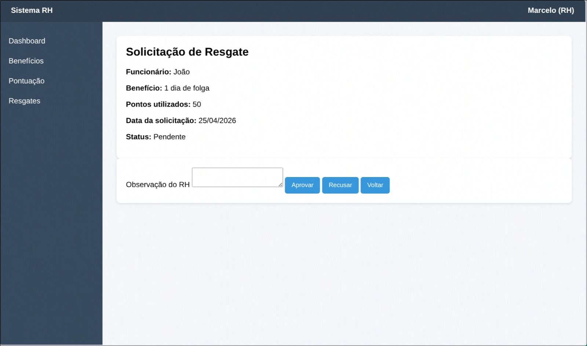
 
---
 
Atividade 13 **Acessar Histórico de Pontos dos Funcionários**
| **Campo** | **Tipo** | **Restrições** | **Valor default** |
| --- | --- | --- | --- |
| Total de funcionários | Número | Somente leitura | — |
| Funcionário | Caixa de texto | Opcional | — |
| Funcionários | Tabela | Somente leitura; colunas: Funcionário, Cargo, Total de pontos, Último resgate, Histórico | — |
 
| **Comandos** | **Destino** | **Tipo** |
| --- | --- | --- |
| Filtrar | Acessar Histórico de Pontos dos Funcionários | default |
| Visualizar | Acessar Histórico do Funcionário | default |
 
---
 
Atividade 14 **Acessar Histórico do Funcionário**
| **Campo** | **Tipo** | **Restrições** | **Valor default** |
| --- | --- | --- | --- |
| Nome do funcionário | Texto | Somente leitura | — |
| Cargo | Texto | Somente leitura | — |
| Total atual de pontos | Número | Somente leitura | — |
| Resgates do Funcionário | Tabela | Somente leitura; colunas: Benefício, Pontos usados, Status, Data | — |
 
| **Comandos** | **Destino** | **Tipo** |
| --- | --- | --- |
| Visualizar | Ver Detalhes do Resgate | default |
| Voltar | Acessar Histórico de Pontos dos Funcionários | default |
 
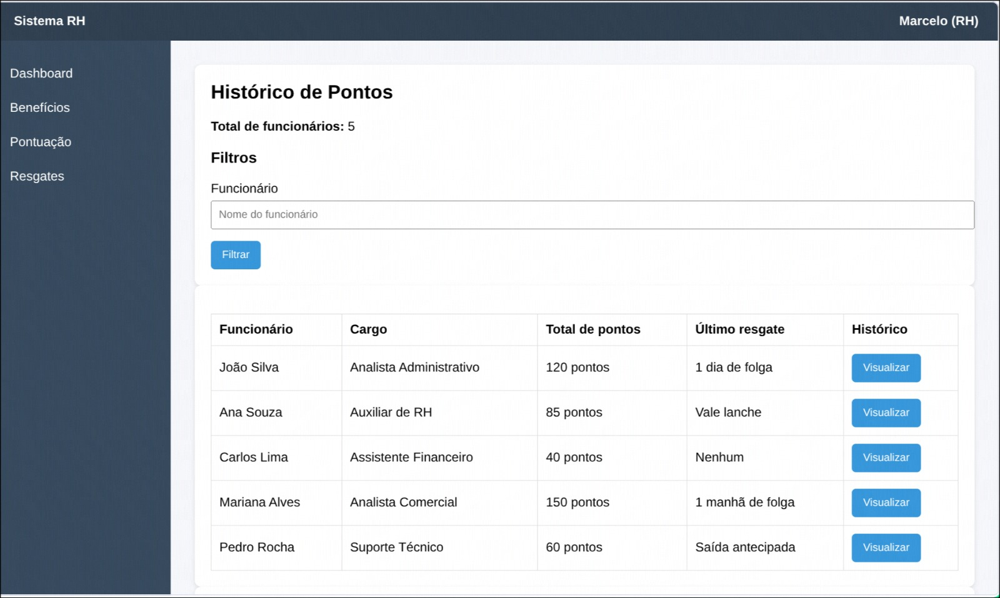
 
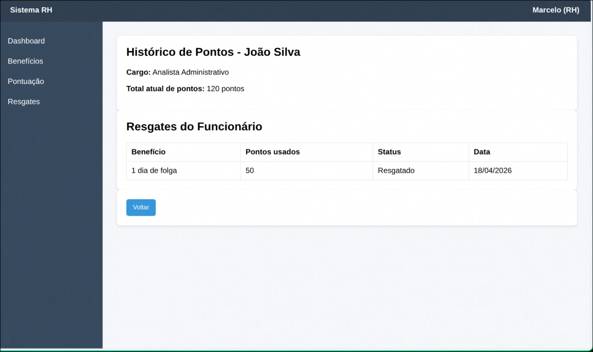
